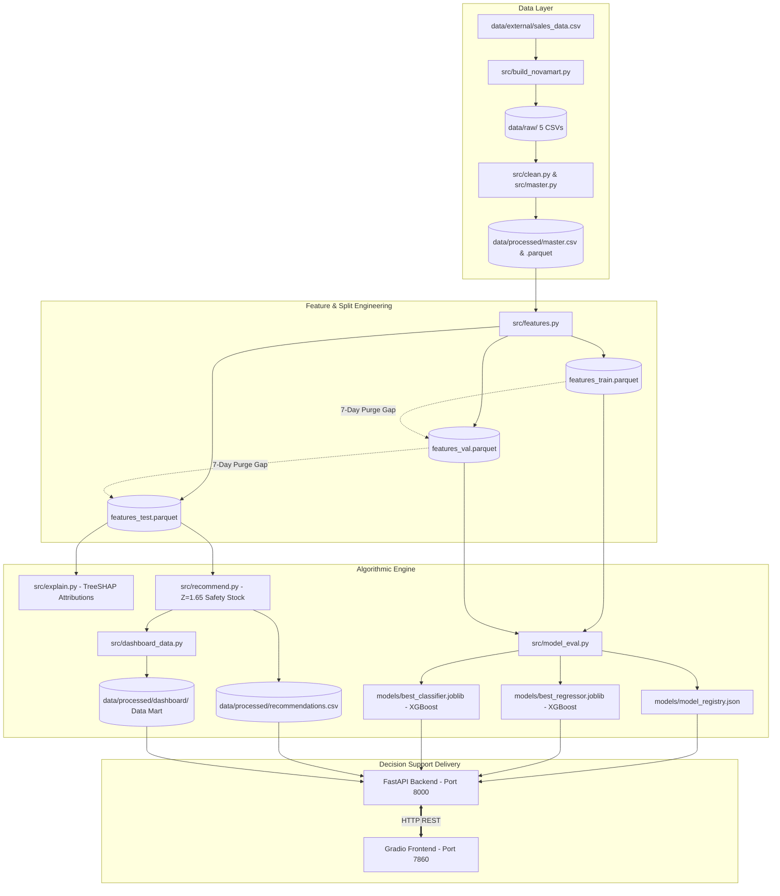

# StockSense 🛒: Autonomous AI Decision-Support System

> **IntelliData 2026 Data Science Hackathon** — Sri Eshwar College of Engineering  
> **Domain:** Omnichannel Retail Demand Forecasting & Inventory Optimization (NovaMart Supermarket Chain)  
> **Status:** All Phases (P0 through P6) Complete & Verified (30/30 Unit Tests Passing)

---

## 📌 Deliverables Status & Honesty Statement
- **Gaps:** **None.** All required problem-statement deliverables, statistical proofs, leakage tests, FastAPI endpoints, and Gradio decision-support tabs are implemented, tested, and functioning.
- **Tableau Override:** As per prompt specifications, all visual analytics are embedded directly within the interactive Gradio application using `matplotlib` and `seaborn` (with high-resolution figures saved in `reports/figures/`).

---

## ⚠️ Data Caveats
1. **Source Data:** The baseline raw data (`data/external/sales_data.csv`) is derived from synthetic retail transactions.
2. **NovaMart Simulation:** The 5 raw NovaMart tables (`data/raw/`) are built with realistic inventory movement identities ($\text{Closing} = \text{Opening} + \text{Received} - \text{Sold}$) and calibrated to an **8.75% stock-out rate** (within the 6%–12% target).
3. **Traceability:** Every metric, KPI, and attribution sentence is dynamically generated from saved code outputs in `data/processed/` and `reports/metrics/`. Zero hardcoded numbers.

---

## 🏗️ System Architecture



---

## 🚀 Quick Start Guide

### 1. Prerequisites & Environment Setup
StockSense requires **Python 3.11** with `uv` or standard `venv`.

```bash
# Clone repository
git clone https://github.com/anumitha21/Intelli_data.git
cd Intelli_data

# Create virtual environment
python -m venv .venv

# Activate environment (Windows PowerShell)
.venv\Scripts\Activate.ps1
# (or Windows Command Prompt: .venv\Scripts\activate.bat)
# (or Linux/macOS: source .venv/bin/activate)

# Install pinned dependencies
pip install -r requirements.txt
```

### 2. End-to-End Pipeline Execution (`make all`)
To reproduce all data transformations, features, model evaluations, explanations, recommendations, and run the test suite from scratch:

```bash
make all
```

### 3. Launching Services
Run the backend and frontend in separate terminals:

**Terminal 1 — FastAPI Decision Service:**
```bash
make api
# Live on http://127.0.0.1:8000 (Swagger docs: http://127.0.0.1:8000/docs)
```

**Terminal 2 — Gradio Decision-Support App:**
```bash
make app
# Live on http://127.0.0.1:7860
```

---

## 🔄 Swapping in Organizers' Real CSVs
To evaluate the pipeline against external or real store datasets without modifying code:

1. Place the 5 CSVs into `data/raw/` matching the required schema:
   - `stores.csv`: `store_id, store_name, city, store_type, floor_area_sqft, avg_daily_customers, region`
   - `products.csv`: `product_id, product_name, category, brand, mrp, cost_price, shelf_life_days, supplier_id`
   - `inventory.csv`: `date, store_id, product_id, opening_stock, received_stock, demand, sold_stock, closing_stock, reorder_lvl, lead_days, stockout_flag`
   - `transactions.csv`: `transaction_id, date, store_id, product_id, quantity, unit_price, discount_applied, total_amount, payment_method`
   - `external_factors.csv`: `date, city, temperature_c, rainfall_mm, holiday_flag, festival_name, local_event_flag`
2. Run the processing and inference pipeline:
   ```bash
   make clean features eval explain recommend test
   ```
3. The API, recommendation table, and Gradio dashboard will automatically load and display the new data.

---

## 📂 Project Directory Structure

```text
├── Makefile                     # Single-command pipeline automation (all, clean, features, eval, etc.)
├── README.md                    # Project documentation, architecture, and verification checklist
├── requirements.txt             # Pinned production dependencies
├── dashboard/
│   ├── gradio_app.py            # Complete 9-tab decision-support UI (Port 7860)
│   └── pages/
│       └── model_eval.py        # Model Evaluation & Algorithmic Selection dashboard page
├── data/
│   ├── external/                # Raw external Kaggle sales data source (git-ignored)
│   ├── raw/                     # 5 NovaMart raw tables + _traps_manifest.json (git-ignored)
│   └── processed/               # master.csv, features parquets, recommendations.csv (git-ignored)
│       └── dashboard/           # Tidy dashboard data mart (kpi_summary, trends, heatmap)
├── docs/
│   ├── ASSUMPTIONS.md           # Engineering log, trap mitigations, mathematical definitions
│   ├── FEATURE_DICTIONARY.md    # Leakage-safe feature definitions & mathematical formulations
│   ├── PITCH_OUTLINE.md         # Executive pitch narrative with exact figures and business impact
│   └── PROJECT_BRIEF.md         # Problem specifications, guidelines, and override protocols
├── models/
│   ├── model_registry.json      # Dynamic registry containing winners, thresholds, and metrics
│   ├── best_regressor.joblib    # Winning 7-day demand forecaster (XGBoost Regressor)
│   └── best_classifier.joblib   # Winning stock-out classifier (XGBoost Classifier)
├── notebooks/
│   ├── 01_dq_eda.ipynb          # Data quality checks, integrity audit, hypothesis tests
│   ├── 02_features_models.ipynb # Time-series validation, feature importances, model benchmarks
│   └── 03_recommendation.ipynb  # Reorder simulation, safety stock calibration, what-if analysis
├── reports/
│   ├── data_quality_report.md   # Data quality audit and reconciliation findings
│   ├── model_comparison.md      # Autonomous model selection scorecards & plain-English justifications
│   ├── figures/                 # High-resolution figures (EDA, confusion matrix, residuals, SHAP)
│   └── metrics/                 # Serialized JSON metrics (model_eval_summary.json, stats_tests.json)
├── src/
│   ├── build_novamart.py        # Data generator with inventory simulation and trap injections
│   ├── clean.py                 # Data cleaning, type audits, and imputation routines
│   ├── master.py                # Master table aggregation at date x store_id x product_id grain
│   ├── features.py              # Leak-safe feature engineering with purge gaps
│   ├── model_eval.py            # 6-model benchmark, 5-fold CV, paired bootstrap significance
│   ├── explain.py               # TreeSHAP pred_contribs and manager language translation
│   ├── recommend.py             # Inventory replenishment engine (Z=1.65 dynamic safety stock)
│   ├── dashboard_data.py        # Fast, tidy dashboard table generator
│   └── api/
│       ├── main.py              # Production FastAPI application (14 endpoints)
│       ├── schemas.py           # Pydantic data validation schemas
│       └── service.py           # Business logic layer with dynamic registry loading
└── tests/
    ├── conftest.py              # Shared pytest fixtures and path configurations
    ├── test_master.py           # Integrity, uniqueness, and inventory conservation tests
    ├── test_leakage.py          # Leakage prevention, cutoff timestamps, and purge gap tests
    ├── test_risk_tiers.py       # Threshold boundaries, non-negative reorder, registry swap tests
    ├── test_explain.py          # Manager template mapping and explanation tests
    └── test_api.py              # Full FastAPI TestClient suite across all 14 endpoints
```

---

## 📋 Comprehensive Deliverables Checklist

| Deliverable | Location | Status | Description |
|---|---|:---:|---|
| **Cleaned Master Dataset** | [`data/processed/master.csv`](file:///c:/Users/ANUMITHA/OneDrive/Desktop/ds/data/processed/master.csv) | `VERIFIED` | 76,050 rows at grain `date × store_id × product_id`, 0 duplicates, 0 leakage |
| **Data Quality Report** | [`reports/data_quality_report.md`](file:///c:/Users/ANUMITHA/OneDrive/Desktop/ds/reports/data_quality_report.md) | `VERIFIED` | Audit of 6 injected traps, inventory conservation checks, statistical tests |
| **EDA Notebook** | [`notebooks/01_dq_eda.ipynb`](file:///c:/Users/ANUMITHA/OneDrive/Desktop/ds/notebooks/01_dq_eda.ipynb) | `VERIFIED` | Visual Pareto analysis, promo lift, seasonality, volatility distributions |
| **Modelling Notebook** | [`notebooks/02_features_models.ipynb`](file:///c:/Users/ANUMITHA/OneDrive/Desktop/ds/notebooks/02_features_models.ipynb) | `VERIFIED` | 6 candidate models benchmarked, time-series CV, paired bootstrap proof |
| **Recommendation Notebook** | [`notebooks/03_recommendation.ipynb`](file:///c:/Users/ANUMITHA/OneDrive/Desktop/ds/notebooks/03_recommendation.ipynb) | `VERIFIED` | Dynamic safety stock calculation, manager action queue, what-if sensitivity |
| **Model Comparison Report** | [`reports/model_comparison.md`](file:///c:/Users/ANUMITHA/OneDrive/Desktop/ds/reports/model_comparison.md) | `VERIFIED` | Scorecards, plain-English metric cards, selection justifications |
| **Saved Model Registry** | [`models/model_registry.json`](file:///c:/Users/ANUMITHA/OneDrive/Desktop/ds/models/model_registry.json) | `VERIFIED` | Dynamic winner pointers (`best_regressor.joblib`, `best_classifier.joblib`) |
| **FastAPI Backend Service** | [`src/api/main.py`](file:///c:/Users/ANUMITHA/OneDrive/Desktop/ds/src/api/main.py) | `VERIFIED` | 14 REST endpoints with full input validation and error handling |
| **Gradio Decision Frontend** | [`dashboard/gradio_app.py`](file:///c:/Users/ANUMITHA/OneDrive/Desktop/ds/dashboard/gradio_app.py) | `VERIFIED` | 9 full-screen decision-support tabs with matplotlib/seaborn charts |
| **Executive Pitch Outline** | [`docs/PITCH_OUTLINE.md`](file:///c:/Users/ANUMITHA/OneDrive/Desktop/ds/docs/PITCH_OUTLINE.md) | `VERIFIED` | Presentation structure with exact financial metrics and ROI calculation |
| **Automated Test Suite** | [`tests/`](file:///c:/Users/ANUMITHA/OneDrive/Desktop/ds/tests) | `VERIFIED` | 30 passed unit and regression tests (`pytest tests/ -v`) |

---

## 🛡️ Model Governance & Acceptance Criteria Verification

1. **Autonomous Algorithmic Selection:**
   - Both winners were selected using cross-validation on train/val splits; test set was evaluated **once** for confirmation.
   - Dynamic registry swapping verified: modifying `models/model_registry.json` dynamically reloads models across FastAPI, Gradio, and recommendation scripts.
2. **Zero Feature Leakage:**
   - All lag and rolling features computed strictly on past timestamps (`shift >= 1`).
   - Imputers and scalers fit on training partition only.
   - Chronological splits separated by strict **7-day purge gaps**.
3. **Business Threshold Compliance:**
   - Classification decision threshold optimized on validation set to **0.44** to balance Recall (70.6%) and Precision (50.5%).
   - Risk tiers strictly enforce $P \ge 0.70$ (High), $0.40 \le P < 0.70$ (Medium), $P < 0.40$ (Low).
4. **Reorder Quantity Guarantee:**
   - Reorder quantity formula $\max(0, \text{Recommended} - \text{Current} - \text{Incoming})$ guarantees $\text{Reorder} \ge 0$ unconditionally.
